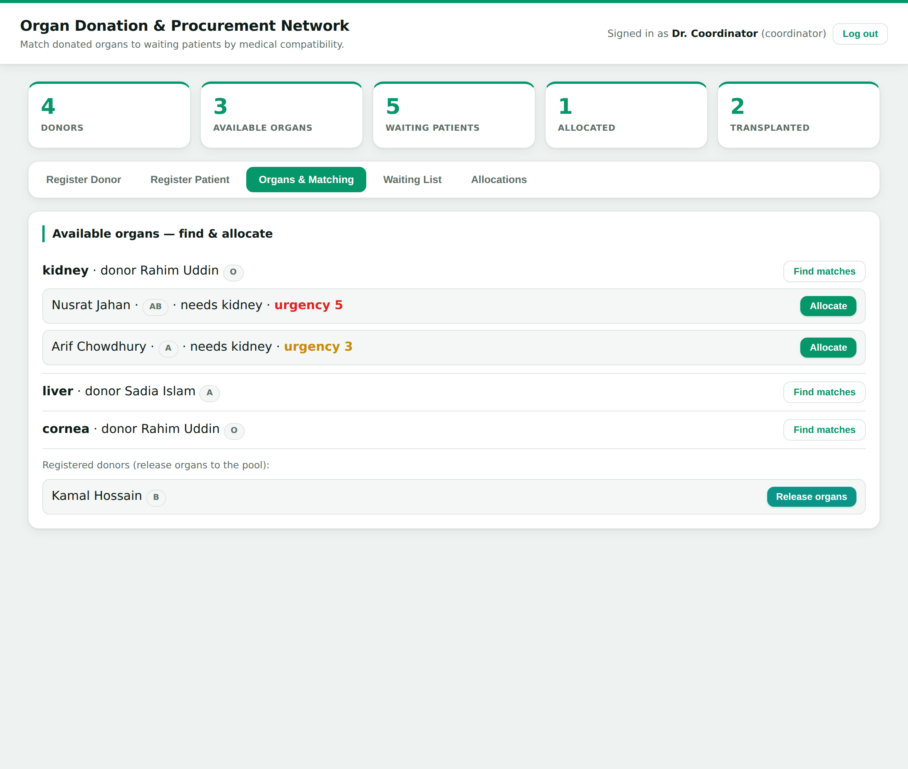

# Organ Donation & Procurement Network Management System

A full-stack system that registers organ **donors** and waiting **patients**,
**matches** donated organs to compatible recipients by medical rules, and tracks
**allocation** and **transplantation** across participating hospitals.



## What it demonstrates

- A **REST API** (FastAPI) with role-based access and JWT authentication.
- **Relational database design** (SQLite): users, hospitals, donors, organs,
  patients, and an allocations audit trail, with foreign keys, constraints,
  and indexes.
- A **medical matching engine**: ABO blood-group compatibility + organ-type
  matching, with candidates ranked by urgency and waiting time.
- **Layered architecture** — the matching engine and business rules are pure,
  framework-independent modules, unit-tested without a web server.

## Roles

| Role         | Can do                                                        |
|--------------|---------------------------------------------------------------|
| `donor`      | Register as a donor and pledge organs                         |
| `patient`    | Join the waiting list                                         |
| `coordinator`| Hospital/OPO staff: release organs, run matching, allocate, complete transplants |
| `admin`      | Everything, plus manage hospitals                             |

A demo admin is seeded on first run: **`admin@organnet.local` / `admin123`**.

## The matching rules (the core)

An organ can go to a patient only if the **organ type** matches what the patient
needs **and** the blood groups are **ABO-compatible**:

```
donor  ->  compatible recipients
  O    ->  O, A, B, AB     (universal donor)
  A    ->  A, AB
  B    ->  B, AB
  AB   ->  AB              (universal recipient)
```

Among compatible patients, candidates are ranked **highest urgency first**, and
for ties, **longest waiting first**. (Real allocation also weighs HLA typing,
Rh, organ size, geography and ischemic time — deliberately out of scope, and
noted in `app/matching.py`.)

## Architecture

```
app/
  config.py     settings from environment
  security.py   PBKDF2 password hashing + HS256 JWT  (stdlib only)
  matching.py   ABO compatibility + candidate ranking  ← pure, exhaustively tested
  db.py         SQLite schema + data-access functions
  service.py    business rules + domain errors  ← framework-independent
  schemas.py    Pydantic request/response models
  main.py       FastAPI routes (thin)
static/
  index.html    single-page dashboard (no build step)
tests/
  test_matching.py   the matching engine
  test_service.py    the full lifecycle end to end
```

## REST API

| Method & path                          | Auth          | Purpose                    |
|----------------------------------------|---------------|----------------------------|
| `POST /auth/register` · `/auth/login`  | –             | Accounts + JWT             |
| `GET  /hospitals` · `POST /hospitals`  | staff to add  | Hospitals                  |
| `GET  /donors` · `POST /donors`        | login to add  | Donors + pledged organs    |
| `POST /donors/{id}/release`            | staff         | Release organs into pool   |
| `GET  /patients` · `POST /patients`    | login to add  | Waiting list               |
| `GET  /organs/available`               | –             | Organ pool                 |
| `GET  /organs/{id}/candidates`         | staff         | **Ranked match preview**   |
| `POST /allocations`                    | staff         | Allocate organ → patient   |
| `POST /allocations/{id}/transplant`    | staff         | Complete a transplant      |
| `GET  /allocations` · `GET /stats`     | –             | Audit trail + dashboard    |

Interactive Swagger docs are auto-generated at **`/docs`**.

## Running it

```bash
python -m venv .venv && source .venv/bin/activate   # Windows: .venv\Scripts\activate
pip install -r requirements.txt
uvicorn app.main:app --reload        # open http://127.0.0.1:8000
```

Log in with the seeded admin, register a donor, click **Release organs**, add a
patient to the waiting list, then **Find matches** on the organ and **Allocate**.

## Deploy (live demo)

The repo includes a `render.yaml` blueprint. On [Render](https://render.com):
**New + → Blueprint → pick this repo → Apply.** Render installs
`requirements.txt` and runs
`uvicorn app.main:app --host 0.0.0.0 --port $PORT`, then serves the app at a
public `onrender.com` URL. The seeded demo admin (`admin@organnet.local` /
`admin123`) is available on first boot. (Free instances sleep when idle and use
an ephemeral database, which is ideal for a demo.)

## Running the tests

```bash
pytest -q      # 15 tests: matching engine + full allocation lifecycle
```

## Security notes

Passwords are hashed with PBKDF2-HMAC-SHA256 (per-user salt); tokens are signed
and expire. Hashing and JWT are implemented with the standard library to keep
dependencies minimal and the mechanics inspectable — a production system would
use vetted libraries and a managed database, and would not expose the raw
registries without finer-grained access control.

## Possible next steps

- Postgres/MySQL for production concurrency.
- HLA tissue typing and geographic proximity in the ranking.
- Notifications to hospitals when a match is found.
- Full audit logging and consent records.

---

### One-line description for a CV / portfolio

> Built an Organ Donation & Procurement Network Management System (Python,
> FastAPI, SQLite) with a REST API, JWT role-based auth, a relational schema, and
> a medical matching engine that pairs organs to patients by ABO compatibility
> and urgency/wait-time ranking — backed by a 15-case test suite.
